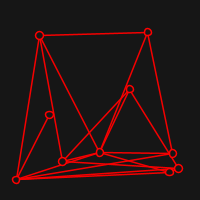
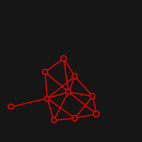

# Fruchterman-Reingold algorithm for directed force Graph drawing

This implementation is not focused on performance, but in experimenting
with this relatively simple algorithm, and visualising its process.

## Conceptual Idea

So the idea of a Graph drawing is simply to draw the graph in a
"pleasing" way whatever this means. The way that Fruchterman and
Reingold approach this is to think vertices as particles in space
that exert repulsive force to the others and attractive force
to the ones that are connected by some edge.

## Visualisation
Live visualisation is implemented with [quil](http://www.quil.info/). Here
are some examples of starting positions (random) and resulting ones:

#### [Dürer Graph](https://en.wikipedia.org/wiki/D%C3%BCrer_graph)
 

#### [K7](https://en.wikipedia.org/wiki/Complete_graph)
 

#### Twin K5
 

#### Random Graph of 10 vertices. [Generated with p=0.41, seed=-957442595]
 

#### Random Graph of 20 vertices. [Generated with p=0.15, seed=-173247684]
 
