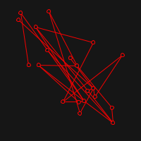
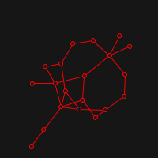

# Fruchterman-Reingold algorithm for directed force Graph drawing

This implementation is not focused on performance, but in experimenting
with this relatively simple algorithm, and visualising its process.

## Main Idea

The idea of a Graph drawing is simply to take a graph and display it on a
screen in a "pleasing" way whatever this means. The way that Fruchterman and
Reingold approach this, is to think vertices as particles in space
that exert repulsive force to the others and attractive force
to the ones that are connected by some edge.

## Visualisation
Live visualisation is implemented with [quil](http://www.quil.info/). Here
are some examples of starting positions (random) and resulting ones:

#### [Dürer Graph](https://en.wikipedia.org/wiki/D%C3%BCrer_graph)
 


#### [K7](https://en.wikipedia.org/wiki/Complete_graph)
 

#### Twin K5
 


#### Random Graph of 10 vertices. [Generated with p=0.41, seed=-957442595]
 


#### Random Graph of 20 vertices. [Generated with p=0.15, seed=-173247684]
 


## Usage

Execute with

```
lein run
```

In order to try out other graphs is likely that you only need to change some of
the following lines of [core.clj](https://github.com/Average-user/fruchterman-reingold/blob/master/src/fruchterman_reingold/core.clj):

``` clojure
(def W 600)
(def H 600)
(def line-weight 3)
(def node-radius 15)

(defn setup []
  (q/ellipse-mode :center)
  (q/frame-rate 60)
  {:states (al/fruchterman-reingold g/Durer (- W 30) (- H 30) 0.7)
   ;; We need to make with and height a little smaller since in the actual drawing
   ;; points have area i.e are not really points
   :i -50})
```
`W` (width), `H` (height), `line-weight`, `node-radius` and `frame-rate` all
explain themselves. The first of the `al/fruchterman-reingold` arguments
is the graph (undirected) to be drawn, to exemplify how is that we represent
graphs, here's the complete graph of three vertices:

```Clojure
{:V #{:a :b :c}
 :E #{#{:a :b} #{:a :c} #{:b :c}}}
```
You can either try out some of the graphs in [graphs.clj](https://github.com/Average-user/fruchterman-reingold/blob/master/src/fruchterman_reingold/graphs.clj)
or create your own. In the later case some important observations are that the graph must be
connected and that the elements do not need to be keywords, since we are only
interested in the structural properties of a graph and not its content.

The last argument (`0.7` as default) is the ideal edge length coefficient `C`.
Fruchterman and Reingold approximate the ideal length of edges as `C*sqrt(W*H/|V|)`,
in some cases if we set `C` too small the graph will look too dense, and if we
set it too large It will run out of space.
